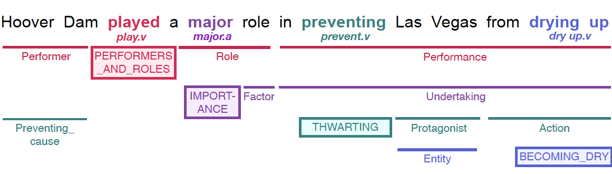

# Frame-Semantic Parsing with BERT Extracted Word and Span Embeddings

Romy Zilkha, Jonathan Schwartz, Jonathan Bofman, Gabriel Clinger

Inspired by the Frame-Semantic Parsing paper ([open-SESAME](https://github.com/swabhs/open-sesame)) that uses a Syntactic Scaffolding approach for Frame-Semantic Parsing. We build upon the existing scaffolding approach by incorporating attention mechanism into two distinct embedding phases (words and spans). We decided to use the huggingface implementation of BERT in order to integrate the attention mechanism into the existing argument identification model.



## Installation

```sh
$ pip install dynet==2.1
$ pip install nltk==3.5
$ python -m nltk.downloader averaged_perceptron_tagger wordnet
```

## Data Preprocessing

```
$ python -m sesame.preprocess
```

## Training

To train a model, run the following command and specifiy in the code itself (line XXX) if you would like to use PCA or autoencoders for the vector dimensionality reduction. The output of the traninig is the trained model and a predicted conll file under `logs/$MODEL_NAME/best-$MODEL-1.7-model`. 

```sh
$ python -m sesame.argid_bert --mode train --model_name $MODEL_NAME
```

## Evaluation 

To evaluate the model, run the following command on the predicted conll file.

```sh
$ python -m evaluation /PATH_TO_OPEN_SESAME_FOLDER/sesame/logs/MODEL_NAME/predicted-1.7-argid-dev.conll
```

## Contact and Reference

For questions and usage issues, please contact `sswayamd@alumni.cmu.edu`. If you use open-sesame for research, please cite [our paper](https://arxiv.org/pdf/1706.09528.pdf) as follows:

```
@article{swayamdipta:17,
  title={{Frame-Semantic Parsing with Softmax-Margin Segmental RNNs and a Syntactic Scaffold}},
  author={Swabha Swayamdipta and Sam Thomson and Chris Dyer and Noah A. Smith},
  journal={arXiv preprint arXiv:1706.09528},
  year={2017}
}
```

